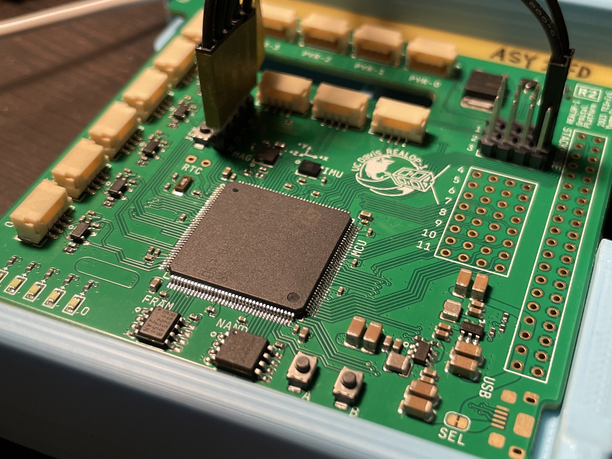

# Orbital Platform

Integrated flight systems board with flight controller, avionics & instrumentation, radio, science, and development support for UC Davis Space and Satellite Systems REALOP-1 mission.

Featured chips: (Many ~~chips~~ are removed for Revision 2. See below.)
 - STM32L476ZGT3 (microcontroller)
 - ASM330LHH (inertial sensor)
 - QMC5883L (magnetometer)
 - ~~ADF7021 (radio front end)~~ 
 - ~~TQP7M9102 (power amplifier)~~ 
 - ~~SKY13453 (rf switch)~~
 - ~~MAX2208 (rf power detector)~~ 
 - W25Q128JVSIQ (flash memory) 
 - MB85RS256B (ferroelectric memory)
 - ~~TMP235 (analog temperature sensor)~~ 

## Documentation:

For an overview of the project, some FAQs, and links to some other documentation, see the [Cattleworks Compendium](https://docs.google.com/document/d/1Hi_DiSkjC-WS4wI39fk3itqsipQI5O-aAOiK9zkmOj8/edit#)

Other useful documents include
- [STM32L47xxx reference manual](https://www.st.com/resource/en/reference_manual/rm0351-stm32l47xxx-stm32l48xxx-stm32l49xxx-and-stm32l4axxx-advanced-armbased-32bit-mcus-stmicroelectronics.pdf)
- [STM32L476xx datasheet](https://www.st.com/resource/en/datasheet/stm32l476zg.pdf)

### toolchain:

For now we're using the Keil SDK for compiling the program, but the `gcc-arm-none-eabi` toolchain can also be used directly, with the flags (as used by Keil's invocation) `-xc -std=c11 --target=arm-arm-none-eabi -mcpu=cortex-m4 -mfpu=fpv4-sp-d16 -mfloat-abi=hard -c
-fno-rtti -funsigned-char -fshort-enums -fshort-wchar`

The compiled program can then be uploaded over SWD using your software of choice.

## Revision 2

Revision 2 hardware of Orbital Platform is in the verification stage. So far, so good!

### Changes 
- Removed radio system: communication function delegated to the new [Orbital Imager](https://github.com/REALOP-ELEC/Orbital_Imager_LRes) 
- Revised layout to improve routing, manufactuability, and reliabiltiy
- Inertial sensor (ASM330LHH) is now connected via SPI for reliability
- Magnetometer (QMC5883L) on its own I2C bus for reliability
- Addition of JST-GH connectors for
  - 6x Solar panels (photodiode + thermistor)
  - 4x Solar panels (pyramid design) 
  - ESC control via PWM
  - ESC control via UART
  - Expansion UART
- Addition of pyrotechnic channel to drive antenna deployment meltwire
- Less LEDs (still a usable amount)
- Fixed EXTI pins: no overlapping signals
- Fixed USB FS implementation 
- Design for manufacturability: reduced cost and BOM lines

## Revision 3

Revision 3 is in the planning stage, no specific design element has been decided. 

Some themes and guidelines for Revision 3:
- Keep software compatibility with R2. Remap a minimal number of pins and don't change existing peripherals.
- Further improve manufacturability.
- Possibly introduce additional features
  - More connectors: Coils, panel temperature sensors, etc.
  - More sensors: High precision temperature sensor, and digitizer for additional thermistors or sensors
- Mechanical adjustments to meet any changes to structures, and possible compatibility with High Altitude Balloon project
- Direct battery voltage measurement

# Getting started

Orbital Platform should be delivered to you with a test program flashed, where it blinks the indicator LEDs in a demo pattern. 

To program and debug the MCU, attach a SWD-compatible debugger like ST-LINK, JLINK, or DAPLINK, to the SWD connector near the MCU. 
| Label | Signal |
| ------------- | ------------- |
| 3 | 3.3 V  |
| G | Ground |
| C | SWCLK  |
| D | SWDIO  |
| R | NRST   |

The reset button is next to the SWD header, labelled RST. 

Use your toolchain of choice to target the `stm32l476zgt` MCU. 

## Using the Keil MDK (μVision) IDE with DAPLINK debugger

One toolchain that works with developing software for Orbital Platform uses the Keil MDK IDE and DAPLINK debugger dongle, on Windows. 
- Start by downloading and installing a free version of Keil MDK-ARM (μVision). You should be able to download it after filling out some info on [the download page](https://www.keil.com/demo/eval/arm.htm)
  - The free version now seems to be called "MDK-Community" and appears to be a non-commercial but fully featured version of the normal IDE. It used to be that the demo/eval/free version had a very restricted code size. Hope this is no longer the case.
- Also download and install STM32CubeMX which is ST's initialization code generator and graphical config editor. Scroll down on [this page](https://www.st.com/en/development-tools/stm32cubemx.html) to Get Software. You might need to fill in some info for this as well. 
- Launch the IDE.
- Find the "Pack Installer" in the top toolbar. It looks like a green diamond shape with four dots inside.
- Use the Pack Installer to install relevant CMSIS device support packs for `STM32L4 Series`
- Close Pack Installer. From the top toolbar, use the menu `Project` -> `New μVision Project` to start a new project.
- When given the option to select target device, choose `STM32L476ZGTx`
- When given the option to manage run time environment, enable `CMSIS -> CORE`, `Device -> Startup`, `Device -> STM32Cube HAL`. There may be dependancies highlighted in yellow, enable those too.
  - Also enable `Device -> STM32Cube Framework (API) -> STM32CubeMX`. If it requires you to press the button to launch CubeMX, do it. Try to proceed with default settings in CubeMX because we don't intend to use any generated code.
  - Don't enable anything else unless you want to use full HAL or other middleware.
- After creating a new project, open `Options for Target` in the top toolbar. Then go to the `Debug` tab and choose Use `CMSIS-DAP debugger`. No additional configuration should be needed.
  - Or choose whatever debugger you use, like ST-Link or J-Link.
- In the left side `Project` panel, right click `Source Group 1` and select `Add new Item to Group`
  - Choose `C File (.c)` and name it `main.c`
  - You need to `#include <stm32l476xx.h>` to import register definitions.
  - Paste some code from this repository or write some blinky program.
  - Alternatively, you can git clone or zip download this repository and directly open the Keil project files. Everything should be configured for DAPLINK targeting Orbital Platform.
- Connect Orbital Platform to DAPLINK via the SWD port. Plug DAPLINK to your computer.
  - The DAPLINK should light up, if it doesn't, unplug it from your computer immediately and check your wiring. There may be a short circuit.
- Click `Build` on the top toolbar, then `Download`. Your code should now be compiled and flashed to Orbital Platform. Click `Debug` to launch the debugger, or signal a hardware reset to begin execution.

