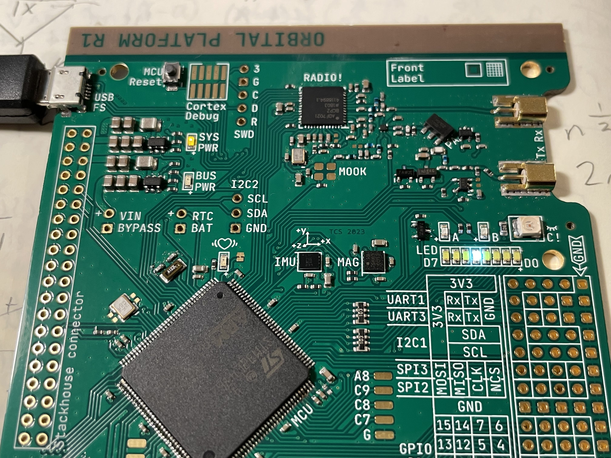

# Orbital Platform
for REALOP-1 mission

Integrated flight systems PCB with flight controller, avionics & instrumentation, radio, science, and development support. 

## Documentation:

For an overview of the project, some FAQs, and links to some other documentation, see the [Cattleworks Compendium](https://docs.google.com/document/d/1Hi_DiSkjC-WS4wI39fk3itqsipQI5O-aAOiK9zkmOj8/edit#)

Other useful documents include
- [STM32L47xxx reference manual](https://www.st.com/resource/en/reference_manual/rm0351-stm32l47xxx-stm32l48xxx-stm32l49xxx-and-stm32l4axxx-advanced-armbased-32bit-mcus-stmicroelectronics.pdf)
- [STM32L476xx datasheet](https://www.st.com/resource/en/datasheet/stm32l476zg.pdf)

### toolchain:

For now we're using the Keil SDK for compiling the program, but the `gcc-arm-none-eabi` toolchain can also be used directly, with the flags (as used by Keil's invocation) `-xc -std=c11 --target=arm-arm-none-eabi -mcpu=cortex-m4 -mfpu=fpv4-sp-d16 -mfloat-abi=hard -c
-fno-rtti -funsigned-char -fshort-enums -fshort-wchar`

The compiled program can then be uploaded over SWD using your software of choice.
